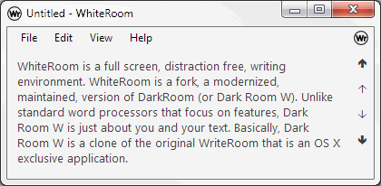
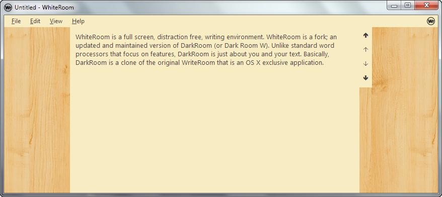
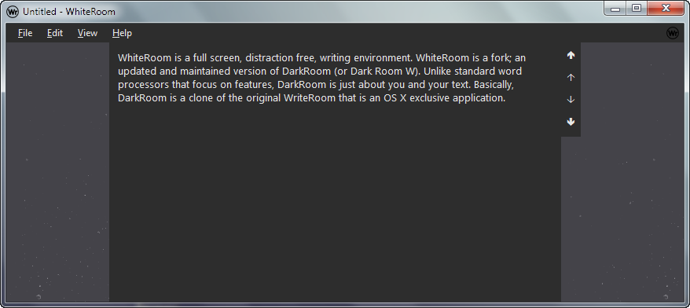
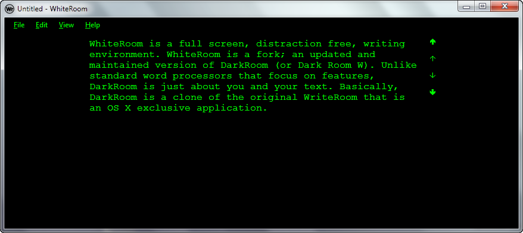

#  WhiteRoom
  
A fork of **DarkRoom** (a **WriteRoom** alternative).  
Released and kept under the [Open Software License v3.0 ("OSL")](LICENSE.md).  
  

  
  
  
### Changes
- Many optimizations, performance fixes and bug fixes.
- Import/Export themes
- Theme the entire application
- Special "Scroll Progress bar"
- Updater fixed
- Toggle full screen from context menu (right-click menu)
- Full screen toggle now correctly restores original window state.
- New Icons (by Yusuke Kamiyamane)
- Customizable background with image
- Added patterns (by Subtle Patterns)
- Added option for page top offset
- Show/Hide page border
- Minor GUI fixes
- etc.
  
### Themes (Included extras)
#### MyBeautifulDesk

#### NightSky

#### DarkRoom (old/original theme)

  
### Credits
The original content for **DarkRoom**:  
- About: http://jjafuller.com/dark-room  
- Source: https://github.com/jjafuller/DarkRoomW  
  
[Fugue Icons](p.yusukekamiyamane.com)  
(C) 2015 Yusuke Kamiyamane. All rights reserved. Creative Commons Attribution-ShareAlike 3.0 Unported (CC BY-SA 3.0)  
  
[Subtle Patterns](http://subtlepatterns.com/)  
(C) 2015 Atle Mo. Creative Commons Attribution-ShareAlike 3.0 Unported (CC BY-SA 3.0)  
